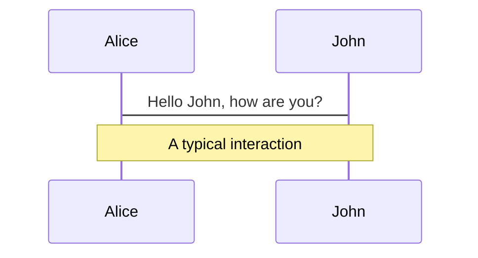
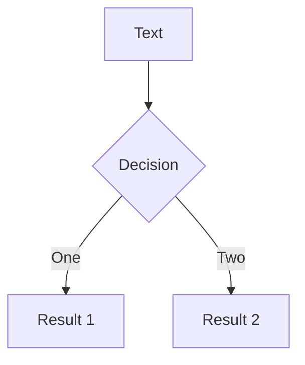
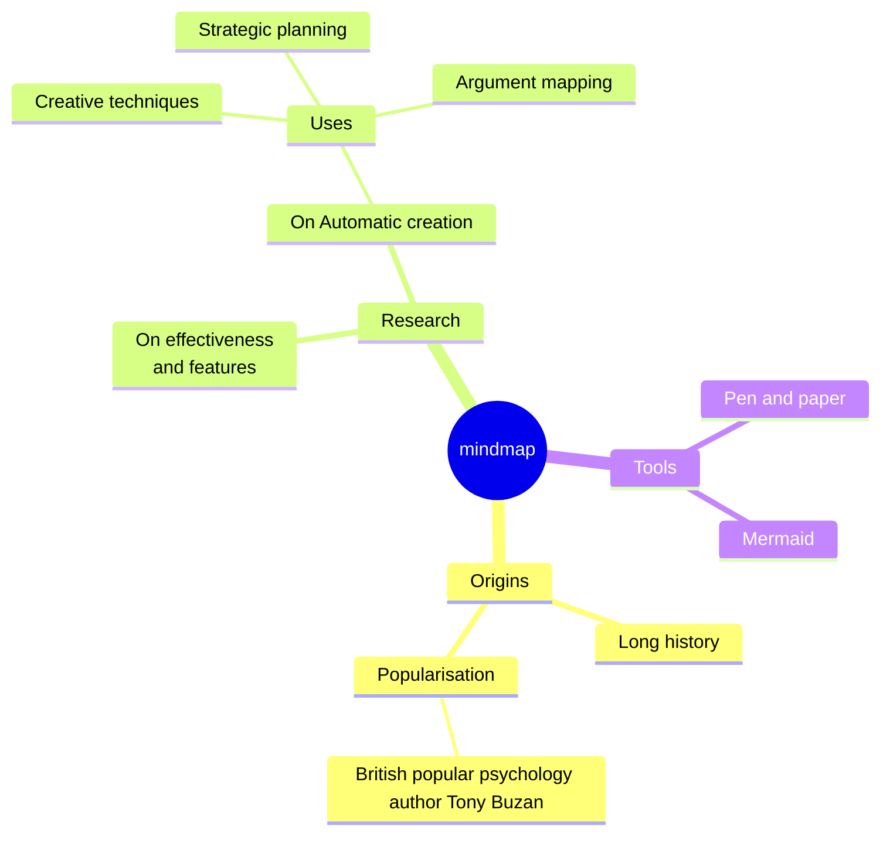
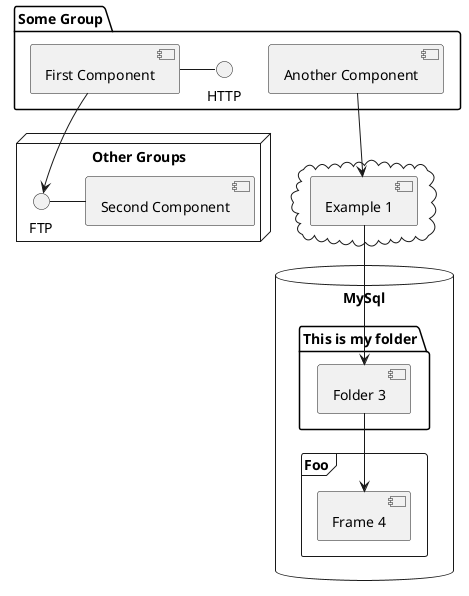

---
# try also 'default' to start simple
theme: seriph
# random image from a curated Unsplash collection by Anthony
# like them? see https://unsplash.com/collections/94734566/slidev
background: https://cover.sli.dev
# some information about your slides, markdown enabled
title: 《React 思維進化》 ch2-8~2-9
info: |
  ## Slidev Starter Template
  Presentation slides for developers.

  Learn more at [Sli.dev](https://sli.dev)
# apply any unocss classes to the current slide
class: text-center
# https://sli.dev/custom/highlighters.html
highlighter: shiki
# https://sli.dev/guide/drawing
drawings:
  persist: false
# slide transition: https://sli.dev/guide/animations#slide-transitions
transition: slide-left
# enable MDC Syntax: https://sli.dev/guide/syntax#mdc-syntax
mdc: true
fonts:
  # basically the text
  sans: Robot Noto Sans
  # use with `font-serif` css class from UnoCSS
  serif: Robot Noto Serif
  # for code blocks, inline code, etc.
  mono: Fira Code
---

# 《React 思維進化》 ch2-8~2-9

畫面更新的發動機：state & 畫面更新的流程機制：reconciliation

<div class="pt-12">
  <span @click="$slidev.nav.next" class="px-2 py-1 rounded cursor-pointer" hover="bg-white bg-opacity-10">
    Press Space for next page <carbon:arrow-right class="inline"/>
  </span>
</div>

<div class="abs-br m-6 flex gap-2">
  <button @click="$slidev.nav.openInEditor()" title="Open in Editor" class="text-xl slidev-icon-btn opacity-50 !border-none !hover:text-white">
    <carbon:edit />
  </button>
</div>

<!--
The last comment block of each slide will be treated as slide notes. It will be visible and editable in Presenter Mode along with the slide. [Read more in the docs](https://sli.dev/guide/syntax.html#notes)
-->

---

```yaml
transition: slide-left
```

# 什麼是 state?

- 前端很常遇到使用者與網頁互動，進而使網頁產生變化的情境
  - 需要記錄這些「可更新的資料」以維持應用運作，在資料更新時連動更新畫面，此類資料通常稱為應用程式的「state(狀態資料)」
- 單向資料流：原始資料更新時，畫面才會更新，原始資料是畫面結果的起點
  - React 的 state 機制扮演「可更新的原始資料(也常稱作狀態)」角色，作為單向資料流起
    

<!--
You can have `style` tag in markdown to override the style for the current page.
Learn more: https://sli.dev/guide/syntax#embedded-styles
-->

<!--
Here is another comment.
-->

---

```yaml
transition: slide-up
level: 2
```

# state 與 component

- React 採一律重繪策略，但只重繪**跟被更新資料有關的畫面區塊**

<br>

#### 怎麼知道哪些畫面跟被更新的資料有關?

> 以 component 作為 state 運作的載體及一律重繪的界線

- 運作的載體
  - state 需依附在 component 上才能記憶、維持狀態資料，生命週期隨 component 存亡
  - 可將 state 視為「component 內的資料記憶體」
- 一律重繪的界線
  - 發起 state 更新並啟動重繪時，只會重繪該 component （包含其子孫 component） 以內的畫面區塊

---

```yaml
transition: fade-out
```

# useState 初探

- `useState` hook 可定義、更新狀態資料，並觸發 component re-render，進而更新瀏覽器畫面
  - 只能在 component function 內呼叫
  - 可想成是一種「在 component 內註冊並存取狀態資料」的工具

<div  class='note-block'>
💡 Hooks：React 提供的 API，只能在 function component 內的頂層作用域才能呼叫的特殊函式，可將 React 核心特性或功能注入到 component 中
</div>

---

```yaml
transition: fade
```

# useState 使用方式

```js
import { useState } from 'react';
export default function App(props) {
  const [state, setState] = useState(initialState);
  //...
}
```

- 參數：state 初始值，可以是任意型別的值
- 回傳值：回傳一個陣列，陣列包含兩個項目
  - 第一個項目是「該次 render 的當前 state 值」
  - 第二個項目是「用來更新 state 值的 `setState` 方法」，是一個 JavaScript 函式
    - 呼叫 `setState` 時傳入新的 state 值作為參數，以取代舊的 state 值，並觸發 component re-render
- 開發慣例
  - 以陣列解構取得 state 的值和 `setState` 方法
  - 根據商業邏輯自訂變數名稱，如：`const [count, setCount] = useState(0);        
`

---

```yaml
transition: fade-out
```

# useState 應用範例

```jsx {all}{maxHeight:'400px'}
import { useState } from 'react';
export default function Counter() {
  //呼叫 useState 定義一個 state，來記憶計數器的值，且初始值為0
  const [count, setCount] = useState(0);

  const handleDecrementButtonClick = () => {
    //以參數指定新的state值為目前count-1
    setCount(count - 1);
  };

  const handleIncrementButtonClick = () => {
    //以參數指定新的state值為目前count+1
    setCount(count + 1);
  };

  return (
    <div>
      <button onClick={handleDecrementButtonClick}>-</button>
      {/* count是useState取出的state的值，count一開始會是我們給的初始值0 */}
      <span>{count}</span>
      <button onClick={handleIncrementButtonClick}>+</button>
    </div>
  );
}
```

---

```yaml
transition: fade
```

# onClick 事件綁定

- 在 React，可透過 React element 來間接管理和綁定事件到實際 DOM element 上

<br>

#### 如何綁定事件?

- 在對應實際 DOM element 類型的 React element 上新增 `onClick` prop，並傳遞事件處理函式給該 prop

```jsx
const MyButton = () => {
  const handleClick = () => {
    console.log('click!');
  };
  return <button onClick={handleClick}>click me</button>;
};
```

---

```yaml
transition: slide-up
level: 2
```

# 補充：只有對應實際 DOM element 的 React element 才會內建事件綁定的 prop

<br class='hidden'>
React element 可分為 3 種類型：

- 可對應實際 DOM element，如：`<h1>`、`<p>`、`<button>`
  - 只有此類才會內建事件綁定的 `prop`
  - 例如： ` <button onClick={handleClick}>`，React 會自動綁定事件到該 button，類似幫你做 `button.addEventListener("click", handleClick);`
- 對應自定義的 component function，如：`<MyComponent >`
  - 傳遞事件綁定的 props 沒有任何效果，只是剛好自定義 prop 也叫 `onClick`
- Fragment 類型，也就是 `<>` 或 `<Fragment>`
  - 傳遞 `key` 以外的其他 props 沒有意義

---

```yaml
transition: fade
```

# 使用 setState 方法

- 點擊按鈕，呼叫 `setState` 觸發狀態資料更新，並連動畫面更新
- `setState` 使用方式：
  - 參數：要更新的新值 nextState，可以是任何型別的值
    - 如果傳入函式，這函式會被視為 updater function，updater function 會拿到一個 pending state 作為參數，並回傳要更新的新值 nextState ([參考官網範例](https://react.dev/reference/react/useState#updating-state-based-on-the-previous-state))
  - 回傳值：無
- `setState` 觸發 component 的 re-render 時，會重新執行 component function，產生新版本的 React element
  - 再次執行到 `useState` 時，得到的回傳值 state 就是新的 state 值 (也就是上次 `setState` 傳入的新值)

<div  class='note-block'>
💡 呼叫 <code>setState</code> 後，React 不會立即觸發 re-render，而是等正在執行的事件內所有程式結束後，才開始執行 re-render，因此會聽到「<code>setState</code> 是非同步的」這種說法。
</div>

<!--
呼叫 <code>setState</code> 後，React 不會立即觸發 re-render，而是等正在執行的事件內所有程式結束後，才開始執行 re-render，因此會聽到「<code>setState</code> 是非同步的」這種說法。
因為 React 採用 batching 的機制來將更新排入佇列，之後才安排一次執行所有更新。
-->

---

```yaml
transition: fade-out
```

# 使用 setState 方法

  

---

```yaml
transition: fade
```

# 使用 setState 方法

  

---

```yaml
transition: slide-up
```

# state 的補充觀念

## Hooks 的限制

- 只能在 component function 內被呼叫，hooks 需依賴 component 才能運作
- 只能在 component function 的頂層作用域被呼叫，不能在條件式、迴圈或 callback 函式中呼叫

```jsx {all}{maxHeight:'200px'}
function MyComponent() {
  //✅ 合法的 hooks 呼叫: 在 component function 的頂層作用域呼叫
  useState();

  if(...){
    //⛔️ 非法的 hooks 呼叫，沒有在 component function 的頂層作用域呼叫
    useState();
  }
  for(...){
    //⛔️ 非法的 hooks 呼叫，沒有在 component function 的頂層作用域呼叫
    useState();
  }
}
useState(); // ⛔️ 非法的 hooks 呼叫，沒有在 component function 內呼叫
```

<br>

#### 為何 hooks 有這些限制?

- 為了確保 hooks 機制正確運作，沒遵守規定可能導致資料丟失問題

---

```yaml
transition: fade
```

# state 的補充觀念

## 為什麼 `useState` 的回傳值是一個陣列

- `useState` 回傳值：`[該次 render 的當前狀態值, 更新狀態值的 setState 方法]`
  - 回傳值定義為陣列有助於：呼叫 `useState` 後，更方便的將回傳值[解構賦值](https://developer.mozilla.org/zh-TW/docs/Web/JavaScript/Reference/Operators/Destructuring_assignment)給自定義變數
- 如果回傳的是其他資料型別?
  - `useState` 會回傳兩個值，需要用陣列或物件這種集合的方式來回傳
  - 如果回傳的是物件?
    - 每次都要解構回傳值、並為物件屬性賦予別名
    - 語法上不簡潔

<div class='ml-10'>

```js
//⛔️ 假想回傳物件的情況，非真實 useState 用法
const { state, setState } = useState();

//物件解構時為屬性賦予別名
const { state: count, setState: setCount } = useState(0);
const { state: isOpen, setState: setIsOpen } = useState(false);
```

</div>

---

```yaml
transition: fade-out
```

# state 的補充觀念

## `setState` 方法是更新 state 值並觸發 re-render 的唯一合法手段

- 如何更新 state 資料的值?
  - ✅ **`setState` 是唯一的更新方式**
  - state 是單向資料流起點，資料變更後，才會驅動 React re-render，再更新對應的畫面區塊
- 如果不透過 `setState` 方法，自己修改 state 值會怎樣?
  - ⛔️ React 不知道你修改 state 的值，因此不會觸發 React 的 re-render，也無法讓對應的畫面更新
    - 導致資料與畫面不同步，單向資料流可靠性被破壞

[書中範例：直接修改 state 資料無法觸發 re-render](https://codesandbox.io/p/sandbox/qr-code-2-8-3-zhi-jie-xiu-gai-state-zi-liao-wu-fa-chu-fa-re-render-yu-hua-mian-geng-xin-nhdg2g?file=%2Fsrc%2FApp.jsx)

---

```yaml
transition: slide-up
```

# state 的補充觀念

## React 如何辨認同一個 component 中的多個 state

- 可在 component function 內多次呼叫 `useState` 來定義不同的 state，且每個 state 值互不影響：
  ```js
  const [count, setCount] = useState(0);
  const [name, setName] = useState('Chair');
  ```
- 沒有給 id 或 key 這類的值，React 怎麼知道哪次的 `useState` 要回傳哪個 state 的資料?
  - component 的**所有 hooks 在每次 render 都會依賴固定的呼叫順序**，以區別彼此
    - 對應 hooks 的限制：hooks 只能在 component function 頂層作用域被呼叫
    - 在頂層作用域呼叫 hooks，才能保證每次 render 時，hooks 都會被呼叫、且執行順序固定不變
- 多次呼叫 hooks 時，React 記的是「第一個呼叫的 hook」、「第二個呼叫的 hook」這種順序，以順序區別

---

```yaml
transition: fade
```

# state 的補充觀念

## 同一個 component 的同一個 state，在該 component 的不同實例間的狀態資料獨立

- component 是一種藍圖，可透過藍圖產出實例，產出的實例互不影響
  - state 是依附在 component 上的資料，透過 component 藍圖產出的實例所擁有的 state 也互不影響
    [React state demo](https://codesandbox.io/p/sandbox/react-state-demo-ymg38c?file=%2Fsrc%2FApp.js%3A11%2C11)

<div class='ml-10'>

```jsx
import Counter from './Counter';
export default function App() {
  //這三個 Counter component 實例的 counter state 資料是獨立、互不影響的
  //第一個 Counter component 的 count 的值變動，不會影響另一個 Counter component 的 count 值
  return (
    <div className='App'>
      <Counter />
      <Counter />
      <Counter />
    </div>
  );
}
```

</div>

---

```yaml
transition: fade-out
```

# 補充：props 與 state 的差異


---

```yaml
layout: two-cols
layoutClass: gap-16
```

# Table of contents

You can use the `Toc` component to generate a table of contents for your slides:

```html
<Toc minDepth="1" maxDepth="1"></Toc>
```

The title will be inferred from your slide content, or you can override it with `title` and `level` in your frontmatter.

::right::

<Toc v-click minDepth="1" maxDepth="2"></Toc>

---

layout: image-right
image: https://cover.sli.dev

---

# Code

Use code snippets and get the highlighting directly, and even types hover![^1]

```ts {all|5|7|7-8|10|all} twoslash
// TwoSlash enables TypeScript hover information
// and errors in markdown code blocks
// More at https://shiki.style/packages/twoslash

import { computed, ref } from 'vue';

const count = ref(0);
const doubled = computed(() => count.value * 2);

doubled.value = 2;
```

<arrow v-click="[4, 5]" x1="350" y1="310" x2="195" y2="334" color="#953" width="2" arrowSize="1" />

<!-- This allow you to embed external code blocks -->

<<< @/snippets/external.ts#snippet

<!-- Footer -->

[^1]: [Learn More](https://sli.dev/guide/syntax.html#line-highlighting)

<!-- Inline style -->
<style>
.footnotes-sep {
  @apply mt-5 opacity-10;
}
.footnotes {
  @apply text-sm opacity-75;
}
.footnote-backref {
  display: none;
}
</style>

<!--
Notes can also sync with clicks

[click] This will be highlighted after the first click

[click] Highlighted with `count = ref(0)`

[click:3] Last click (skip two clicks)
-->

---

## level: 2

# Shiki Magic Move

Powered by [shiki-magic-move](https://shiki-magic-move.netlify.app/), Slidev supports animations across multiple code snippets.

Add multiple code blocks and wrap them with <code>````md magic-move</code> (four backticks) to enable the magic move. For example:

````md magic-move
```ts {*|2|*}
// step 1
const author = reactive({
  name: 'John Doe',
  books: [
    'Vue 2 - Advanced Guide',
    'Vue 3 - Basic Guide',
    'Vue 4 - The Mystery',
  ],
});
```

```ts {*|1-2|3-4|3-4,8}
// step 2
export default {
  data() {
    return {
      author: {
        name: 'John Doe',
        books: [
          'Vue 2 - Advanced Guide',
          'Vue 3 - Basic Guide',
          'Vue 4 - The Mystery',
        ],
      },
    };
  },
};
```

```ts
// step 3
export default {
  data: () => ({
    author: {
      name: 'John Doe',
      books: [
        'Vue 2 - Advanced Guide',
        'Vue 3 - Basic Guide',
        'Vue 4 - The Mystery',
      ],
    },
  }),
};
```

Non-code blocks are ignored.

```vue
<!-- step 4 -->
<script setup>
const author = {
  name: 'John Doe',
  books: [
    'Vue 2 - Advanced Guide',
    'Vue 3 - Basic Guide',
    'Vue 4 - The Mystery',
  ],
};
</script>
```
````

---

# Components

<div grid="~ cols-2 gap-4">
<div>

You can use Vue components directly inside your slides.

We have provided a few built-in components like `<Tweet/>` and `<Youtube/>` that you can use directly. And adding your custom components is also super easy.

```html
<!-- <Counter_vue :count="10" /> -->
```

<!-- ./components/Counter.vue -->
<!--
<Counter_vue :count="10" m="t-4" /> -->

Check out [the guides](https://sli.dev/builtin/components.html) for more.

</div>
<div>

```html
<Tweet id="1390115482657726468" />
```

<Tweet id="1390115482657726468" scale="0.65" />

</div>
</div>

<!--
Presenter note with **bold**, *italic*, and ~~striked~~ text.

Also, HTML elements are valid:
<div class="flex w-full">
  <span style="flex-grow: 1;">Left content</span>
  <span>Right content</span>
</div>
-->

---

## class: px-20

# Themes

Slidev comes with powerful theming support. Themes can provide styles, layouts, components, or even configurations for tools. Switching between themes by just **one edit** in your frontmatter:

<div grid="~ cols-2 gap-2" m="t-2">

```yaml
---
theme: default
---
```

```yaml
---
theme: seriph
---
```


</div>

Read more about [How to use a theme](https://sli.dev/themes/use.html) and
check out the [Awesome Themes Gallery](https://sli.dev/themes/gallery.html).

---

# Clicks Animations

You can add `v-click` to elements to add a click animation.

<div v-click>

This shows up when you click the slide:

```html
<div v-click>This shows up when you click the slide.</div>
```

</div>

<br>

<v-click>

The <span v-mark.red="3"><code>v-mark</code> directive</span>
also allows you to add
<span v-mark.circle.orange="4">inline marks</span>
, powered by [Rough Notation](https://roughnotation.com/):

```html
<span v-mark.underline.orange>inline markers</span>
```

</v-click>

<div mt-20 v-click>

[Learn More](https://sli.dev/guide/animations#click-animations)

</div>

---

## preload: false

# Motions

Motion animations are powered by [@vueuse/motion](https://motion.vueuse.org/), triggered by `v-motion` directive.

```html
<div v-motion :initial="{ x: -80 }" :enter="{ x: 0 }">Slidev</div>
```

<div class="w-60 relative mt-6">
  <div class="relative w-40 h-40">
    
    
    
  </div>

  <div
    class="text-5xl absolute top-14 left-40 text-[#2B90B6] -z-1"
    v-motion
    :initial="{ x: -80, opacity: 0}"
    :enter="{ x: 0, opacity: 1, transition: { delay: 2000, duration: 1000 } }">
    Slidev
  </div>
</div>

<!-- vue script setup scripts can be directly used in markdown, and will only affects current page -->
<script setup lang="ts">
const final = {
  x: 0,
  y: 0,
  rotate: 0,
  scale: 1,
  transition: {
    type: 'spring',
    damping: 10,
    stiffness: 20,
    mass: 2
  }
}
</script>

<div
  v-motion
  :initial="{ x:35, y: 40, opacity: 0}"
  :enter="{ y: 0, opacity: 1, transition: { delay: 3500 } }">

[Learn More](https://sli.dev/guide/animations.html#motion)

</div>

---

# LaTeX

LaTeX is supported out-of-box powered by [KaTeX](https://katex.org/).

<br>

Inline $\sqrt{3x-1}+(1+x)^2$

Block

$$
{1|3|all}
\begin{array}{c}

\nabla \times \vec{\mathbf{B}} -\, \frac1c\, \frac{\partial\vec{\mathbf{E}}}{\partial t} &
= \frac{4\pi}{c}\vec{\mathbf{j}}    \nabla \cdot \vec{\mathbf{E}} & = 4 \pi \rho \\

\nabla \times \vec{\mathbf{E}}\, +\, \frac1c\, \frac{\partial\vec{\mathbf{B}}}{\partial t} & = \vec{\mathbf{0}} \\

\nabla \cdot \vec{\mathbf{B}} & = 0

\end{array}
$$

<br>

[Learn more](https://sli.dev/guide/syntax#latex)

---

# Diagrams

You can create diagrams / graphs from textual descriptions, directly in your Markdown.

<div class="grid grid-cols-4 gap-5 pt-4 -mb-6">









</div>

[Learn More](https://sli.dev/guide/syntax.html#diagrams)

---

src: ./pages/multiple-entries.md
hide: false

---

---

# Monaco Editor

Slidev provides built-in Moanco Editor support.

Add `{monaco}` to the code block to turn it into an editor:

```ts {monaco}
import { ref } from 'vue';
import hello from './external';

const code = ref('const a = 1');
hello();
```

Use `{monaco-run}` to create an editor that can execute the code directly in the slide:

```ts {monaco-run}
function fibonacci(n: number): number {
  return n <= 1 ? n : fibonacci(n - 1) + fibonacci(n - 2); // you know, this is NOT the best way to do it :P
}

console.log(Array.from({ length: 10 }, (_, i) => fibonacci(i + 1)));
```

---

layout: center
class: text-center

---

# Learn More

[Documentations](https://sli.dev) · [GitHub](https://github.com/slidevjs/slidev) · [Showcases](https://sli.dev/showcases.html)
